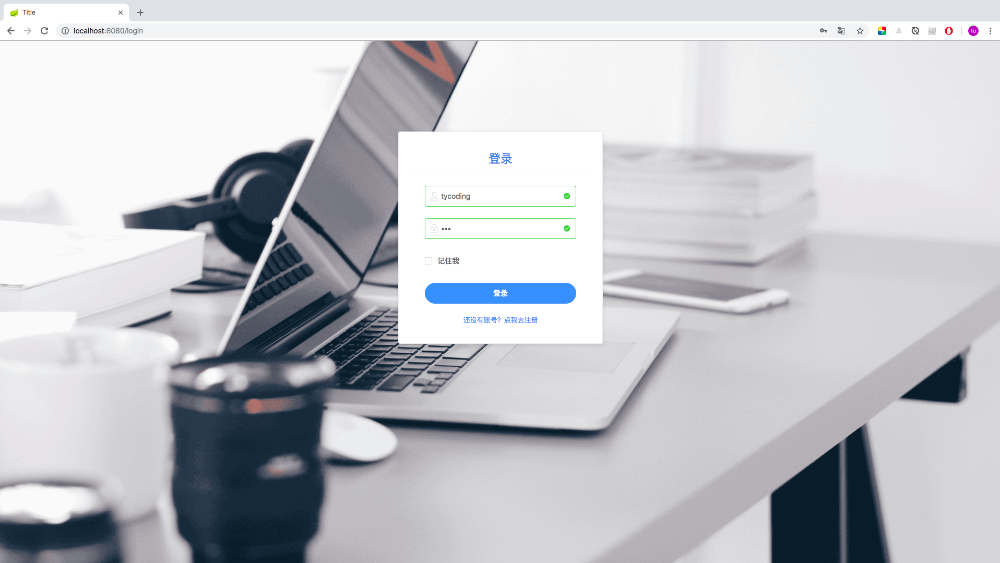
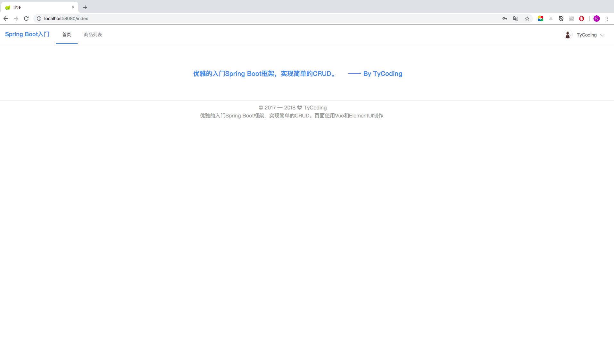
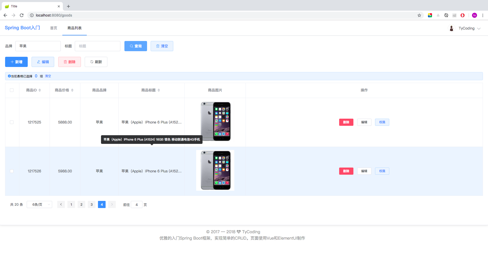
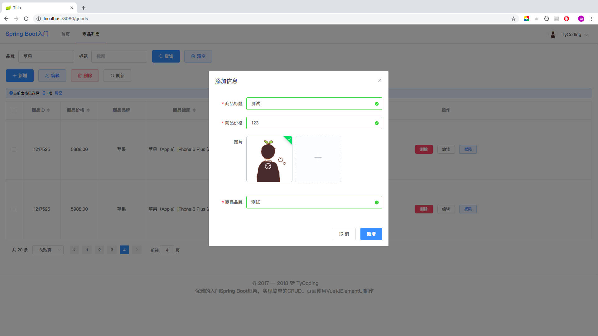

# 教你优雅的入门Spring Boot2.x

**如果觉得不错就点击右上角star鼓励一下笔者吧(#^.^#)**

**技术栈**

* 后端： SpringBoot2.x + Mybatis
* 前端： Vue.JS2.x + ElementUI

**测试环境**

* IDEA + SpringBoot-2.0.5

**启动说明**

* 启动前，请配置好 [application.yml](https://github.com/TyCoding/spring-boot/blob/master/src/main/resources/application.yml) 中连接数据库的用户名和密码，以及Redis服务器的地址和端口信息。

* 启动前，请创建数据库`seckill`，建表SQL语句放在：[/db/sys_schema.sql](https://github.com/TyCoding/spring-boot/blob/master/db/sys_schema.sql)。具体的建表和建库语句请仔细看SQL文件。

* 配置完成后，运行位于 `src/main/cn/tycoding/`下的SpringbootApplication中的main方法，访问 `http://localhost:8080/` 进行API测试。

**项目设计**

```
.
├── README
├── README.md
├── db
├── mvnw
├── mvnw.cmd
├── pom.xml
├── spring-boot.iml
├── src
│   ├── main
│   │   ├── java
│   │   │   └── cn
│   │   │       └── tycoding
│   │   │           ├── SpringbootApplication.java  -- Spring Boot启动器类
│   │   │           ├── controller  -- MVC-WEB层
│   │   │           ├── entity  -- 实体类
│   │   │           ├── interceptor  -- 自定义拦截器
│   │   │           ├── mapper  -- mybatis-Mapper层映射接口，或称为DAO层
│   │   │           └── service  -- service业务层
│   │   └── resources  -- Spring Boot资源文件目录
│   │       ├── application.yml  -- Spring Boot核心配置文件
│   │       ├── mapper  -- Mybatis Mapper层XML配置文件
│   │       ├── static  -- 前端静态文件（主要是JS、CSS、Image文件，一般不放HTML页面）
│   │       │   ├── css
│   │       │   ├── image
│   │       │   ├── js
│   │       │   ├── lib
│   │       └── templates  -- Thymeleaf模板引擎识别的HTML页面目录，存放HTML页面（相当于之前的WEB—INF目录，即不能通过浏览器直接访问）
│   └── test
```

# 准备

开始实战Spring Boot项目，首先，你需要将Spring Boot工程搭建出来。

Spring Boot工程搭建请看我的博客：[Spring Boot入门之工程搭建](http://tycoding.cn/2018/09/28/spring-boot/)

## Spring Boot应用启动器

Spring Boot提供了很多应用启动器，分别用来支持不同的功能，说白了就是`pom.xml`中的依赖配置，因为Spring Boot的自动化配置特性，我们并不需再考虑项目依赖版本问题，使用Spring Boot的应用启动器，它能自动帮我们将相关的依赖全部导入到项目中。

我们这里介绍几个常见的应用启动器：

* `spring-boot-starter`: Spring Boot的核心启动器，包含了自动配置、日志和YAML
* `spring-boot-starter-aop`: 支持AOP面向切面编程的功能，包括spring-aop和AspecJ
* `spring-boot-starter-cache`: 支持Spring的Cache抽象
* `spring-boot-starter-artermis`: 通过Apache Artemis支持JMS（Java Message Service）的API
* `spring-boot-starter-data-jpa`: 支持JPA
* `spring-boot-starter-data-solr`: 支持Apache Solr搜索平台，包括spring-data-solr
* `spring-boot-starter-freemarker`: 支持FreeMarker模板引擎
* `spring-boot-starter-jdbc`: 支持JDBC数据库
* `spring-boot-starter-Redis`: 支持Redis键值储存数据库，包括spring-redis
* `spring-boot-starter-security`: 支持spring-security
* `spring-boot-starter-thymeleaf`: 支持Thymeleaf模板引擎，包括与Spring的集成
* `spring-boot-starter-web`: 支持全栈式web开发，包括tomcat和Spring-WebMVC
* `spring-boot-starter-log4j`: 支持Log4J日志框架
* `spring-boot-starter-logging`: 引入Spring Boot默认的日志框架Logback

## Spring Boot项目结构设计

Spring Boot项目（即Maven项目），当然拥有最基础的Maven项目结构。除此之外：

1. Spring Boot项目中不包含webapp(webroot)目录。
2. Spring Boot默认提供的静态资源目录需要置于classpath下，且其下的目录名称要符合一定规定。
3. Spring Boot默认不提倡用XML配置文件，主张使用YML作为配置文件格式，YML有更简洁的语法。当然也可以使用.properties作为配置文件格式。
4. Spring Boot官方推荐使用Thymeleaf作为前端模板引擎，并且Thymeleaf默认将templates作为静态页面的存放目录（由配置文件指定）。
5. Spring Boot默认将`resources`作为静态资源的存放目录，存放前端静态文件、项目配置文件。

6. Spring Boot规定`resources`下的子级目录名要符合一定规则，一般我们设置`resources/static`为前端静态（JS,CSS）的存放目录；设置`resources/templates`作为HTML页面的存放目录。

7. Spring Boot指定的Thymeleaf模板引擎文件目录`/resources/templates`是受保护的目录，这与之前的WEB项目的WEB-INF文件夹和类似，特点就是里面的静态资源不能直接访问，一般我们通过Controller映射访问。

8. 建议将Mybatis-Mapper的XML映射文件放于`resources/`目录下，我这里设为`resources/mapper`目录，且`src/main/java/Mapper`下的Mapper层接口要使用`@Mapper`注解标识，不然mybatis找不到接口对应的XML映射文件。

9. `SpringBootApplication.java`为项目的启动器类，项目不需要部署到Tomcat上，由SpringBoot提供的服务器部署项目（运行启动器类即可）；且SpringBoot会自动扫描该启动器同级和子级下用注解标识的Bean，也就是之前我们配置的`<context:component-scan>`在SpringBoot中是完全不需类似的配置的。

10. Spring Boot不建议使用JSP页面，如果想使用，请自行百度解决办法。我们常用HTML页面+Thymeleaf模板引擎。Thyemeleaf模板引擎提供了很多内置语法，比如：可以通过`<div th:text="${xx}">`取出来后端存放在域对象中的数据。

11. 上面说了Spring Boot提供的存放HTML静态页面的目录`resources/templates`是受保护的目录，访问其中的HTML页面要通过Controller映射，这就间接规定了你需要配置Spring的视图解析器，且Controller类不能使用`@RestController`标识。


# 起步

*首先：*  **我想特殊强调的是：SpringBoot不是对Spring功能上的增强，而是提供了一种快速使用Spring的方式**。一定要切记这一点。

学习SpringBoot框架，只是为了更简便的使用Spring框架，我们在SSM阶段学习的知识现在放在Spring Boot框架上开发是完全适用的，我们学习的大多数是SpringBoot的自动化配置方式。

因为Spring Boot框架的一大优势就是自动化配置，从pom.xml的配置中就能明显感受到。

所以这里推荐一下我之前的SSM阶段整合项目： [SSM详细入门整合案例](https://github.com/TyCoding/ssm)    [SSM+Redis+Shiro+Solr+Vue.js整合项目](https://github.com/TyCoding/ssm-redis-solr)

## 项目依赖

本项目的依赖文件请看Github仓库：[spring-boot/pom.xml](https://github.com/TyCoding/spring-boot/blob/master/pom.xml)

## 初始化数据库

本项目数据库表设计请看GitHub仓库：[spring-boot/db/](https://github.com/TyCoding/spring-boot/tree/master/db)

请运行项目前，先把数据库表结构建好

## SpringBoot整合Mybatis

之前已经说过：**SpringBoot框架不是对Spring功能上的增强，而是提供了一种快速使用Spring的方式**

所以说，SpringBoot整合Mybatis的思想和Spring整合Mybatis的思想基本相同，不同之处有两点：

* 1.Mapper接口的XML配置文件变化。之前我们使用Mybatis接口代理开发，规定Mapper映射文件要和接口在一个目录下；而这里Mapper映射文件置于`resources/mapper/`下，且置于`src/main/java/`下的Mapper接口需要用`@Mapper`注解标识，不然映射文件与接口无法匹配。

* 2.SpringBoot建议使用YAML作为配置文件，它有更简便的配置方式。所以整合Mybatis在配置文件上有一定的区别，但最终都是那几个参数的配置。

关于YAML的语法请自行百度，我这里也仅仅是满足基本的配置需求，不涉及那种不易理解的语法。

### 整合配置文件

本例详细代码请看GitHub仓库：[spring-boot/resources/application.yml](https://github.com/TyCoding/spring-boot/blob/master/src/main/resources/application.yml)

在Spring阶段用XML配置mybatis无非就是配置：1.连接池；2.数据库url连接；3.mysql驱动；4.其他初始化配置

```YAML
spring:
  datasource:
    name: springboot
    type: com.alibaba.druid.pool.DruidDataSource
    #druid相关配置
    druid:
      #监控统计拦截的filters
      filter: stat
      #mysql驱动
      driver-class-name: com.mysql.jdbc.Driver
      #基本属性
      url: jdbc:mysql://127.0.0.1:3306/springboot?useUnicode=true&characterEncoding=UTF-8&allowMultiQueries=true
      username: root
      password: root
      #配置初始化大小/最小/最大
      initial-size: 1
      min-idle: 1
      max-active: 20
      #获取连接等待超时时间
      max-wait: 60000
      #间隔多久进行一次检测，检测需要关闭的空闲连接
      time-between-eviction-runs-millis: 60000

  #mybatis配置
  mybatis:
    mapper-locations: classpath:mapper/*.xml
    type-aliases-package: cn.tycoding.entity
```

**注意：空格代表节点层次；注释部分用`#`标记**

**解释**

1. 我们实现的是spring-mybatis的整合，包含mybatis的配置以及datasource数据源的配置当然属于spring配置中的一部分，所以需要在`spring:`下。

2. `mapper-locations`相当于XML中的`<property name="mapperLocations">`用来扫描Mapper层的配置文件，由于我们的配置文件在`resources`下，所以需要指定`classpath:`。

3. `type-aliases-package`相当与XML中`<property name="typeAliasesPackase">`别名配置，一般取其下实体类类名作为别名。

4. `datasource`数据源的配置，`name`表示当前数据源的名称，类似于之前的`<bean id="dataSource">`id属性，这里可以任意指定，因为我们无需关注Spring是怎么注入这个Bean对象的。

5. `druid`代表本项目中使用了阿里的druid连接池，`driver-class-name:`相当于XML中的`<property name="driverClassName">`；`url`代表XML中的`<property name="url">`；`username`代表XML中的`<property name="username">`；`password`代表XML中的`<property name="password">`；其他druid的私有属性配置不再解释。这里注意druid连接池和c3p0连接池在XML的<property>的name中就不同，在此处SpringBoot的配置中当然名称也不同。


如果Spring整合Mybtis的配置你已经很熟悉了，那么这个配置你肯定也很眼熟，从英文名称上就很容易区分出来。这里需要注意的就是YAML语法规定不同行空格代表了不同的层级结构。

既然完成了SpringBoot-Mybatis基本配置下面我们实战讲解如何实现基本的CRUD。

### 实现查询

> 1.在`src/main/java/cn/tycoding/entity/`下新建`User.java`实体类

```java
public class User implements Serializable {
    private Long id; //编号
    private String username; //用户名
    private String password; //密码
    //getter/setter
}
```

> 2.在`src/main/java/cn/tycoding/service/`下创建`BaseService.java`通用接口，目的是简化service层接口基本CRUD方法的编写。

```java
public interface BaseService<T> {

    // 查询所有
    List<T> findAll();

    //根据ID查询
    List<T> findById(Long id);

    //添加
    void create(T t);

    //删除（批量）
    void delete(Long... ids);

    //修改
    void update(T t);
}
```

以上就是我对Service层基本CRUD接口的简易封装，使用了泛型类，其继承接口指定了什么泛型，T就代表什么类。

> 3.在`src/main/java/cn/tycoding/service/`下创建`UserService.java`接口：

```java
public interface UserService extends BaseService<User> {}
```

> 4.在`src/main/java/cn/tycoding/service/impl/`下创建`UserServiceImpl.java`实现类：

```java
@Service
public class UserServiceImpl implements UserService {

    @Autowired
    private UserMapper userMapper;

    @Override
    public List<User> findAll() {
        return userMapper.findAll();
    }
  
    //其他方法省略
}
```

> 5.在`src/main/java/cn/tycoding/mapper/`下创建`UserMapper.java`Mapper接口类：

```java
@Mapper
public interface UserMapper {
    List<User> findAll();
}
```

如上，我们一定要使用`@Mapper`接口标识这个接口，不然Mybatis找不到其对应的XML映射文件。

> 6.在`src/main/resources/mapper/`下创建`UserMapper.xml`映射文件：

```xml
<?xml version="1.0" encoding="UTF-8" ?>
<!DOCTYPE mapper PUBLIC "-//mybatis.org//DTD Mapper 3.0//EN" "http://mybatis.org/dtd/mybatis-3-mapper.dtd" >
<mapper namespace="cn.tycoding.mapper.UserMapper">

    <!-- 查询所有 -->
    <select id="findAll" resultType="cn.tycoding.entity.User">
        SELECT * FROM tb_user
    </select>
</mapper>
```

> 7.在`src/main/java/cn/tycoding/controller/admin/`下创建`UserController.java`

```java
@RestController
public class UserController {
    @Autowired
    private UserService userService;
    
    @RequestMapping("/findAll")
    public List<User> findAll() {
        return userService.findAll();
    }
}
```

> 8.运行`src/main/java/cn/tycoding/SpringbootApplication.java`的main方法，启动springboot

在浏览器上访问`localhost:8080/findAll`即可得到一串JSON数据。


### 思考

看了上面一步步的讲解。你应该明白了，其实和SSM阶段的CRUD基本相同，这里我就不再举例其他方法。

下面我们讲解一下不同的地方：

## 实现页面跳转

因为Thymeleaf指定的目录`src/main/resources/templates/`是受保护的目录，其下的资源不能直接通过浏览器访问，可以使用Controller映射的方式访问，怎么映射呢？

> 1.在application.yml中添加配置

```yaml
spring:
  thymeleaf:
    prefix: classpath:/templates/
    check-template-location: true
    suffix: .html
    encoding: UTF-8
    mode: LEGACYHTML5
    cache: false
```

指定Thymeleaf模板引擎扫描`resources`下的`templates`文件夹中已`.html`结尾的文件。这样就实现了MVC中关于视图解析器的配置：

```xml
    <!-- 配置视图解析器 -->
    <bean class="org.springframework.web.servlet.view.InternalResourceViewResolver">
        <property name="prefix" value="/"/>
        <property name="suffix" value=".jsp"/>
    </bean>
```

是不是感觉方便很多呢？但这里需要注意的是：`classpath:`后的目录地址一定要先加`/`，比如目前的`classpath:/templates/`。

> 2.在Controller添加映射方法

```java
    @GetMapping(value = {"/", "/index"})
    public String index() {
        return "home/index";
    }
```

这样，访问`localhost:8080/index`将直接跳转到`resources/templates/home/index.html`页面。


## 实现分页查询

首先我们需要在application.yml中配置pageHelper插件

```yaml
pagehelper:
  pagehelperDialect: mysql
  reasonable: true
  support-methods-arguments: true
```

我这里使用了Mybatis的PageHelper分页插件，前端使用了ElementUI自带的分页插件：具体的教程请查看我的博客：[SpringMVC+ElementUI实现分页查询](http://tycoding.cn/2018/07/30/vue-6/)

**核心配置：**

`UserServiceImp.java`

```java
    public PageBean findByPage(Goods goods, int pageCode, int pageSize) {
        //使用Mybatis分页插件
        PageHelper.startPage(pageCode, pageSize);

        //调用分页查询方法，其实就是查询所有数据，mybatis自动帮我们进行分页计算
        Page<Goods> page = goodsMapper.findByPage(goods);

        return new PageBean(page.getTotal(), page.getResult());
    }
```

## 实现文件上传

这里涉及的无非就是SpringMVC的文件上传，详细的教程请参看我的博客：[SpringMVC实现文件上传和下载](http://tycoding.cn/2018/05/31/Spring-6/)

因为本项目中前端使用了ElementUI+Vue.JS技术，所以前端的文件上传和回显教程请看我的博客：[SpringMVC+ElementUI实现图片上传和回显](http://tycoding.cn/2018/08/05/vue-7/)

除了代码的编写，这里还要在application.yml中进行配置：

```yaml
spring:
  servlet:
    multipart:
      max-file-size: 10Mb
      max-request-size: 100Mb
```

这就相当于SpringMVC的XML配置：

```xml
<bean id="multipartResolver" class="org.springframework.web.multipart.commons.CommonsMultipartResolver">
        <property name="maxUploadSize" value="500000"/>
</bean>
```

## 使用Spring AOP切面编程实现简单的登录拦截器

本项目，我们先不整合Shiro和Spring Security这些安全框架，使用Spring AOP切面编程思想实现简单的登录拦截：

```java
@Component
@Aspect
public class MyInterceptor {

    @Pointcut("within (cn.tycoding.controller..*) && !within(cn.tycoding.controller.admin.LoginController)")
    public void pointCut() {
    }
    @Around("pointCut()")
    public Object trackInfo(ProceedingJoinPoint joinPoint) throws Throwable {
        ServletRequestAttributes attributes = (ServletRequestAttributes) RequestContextHolder.getRequestAttributes();
        HttpServletRequest request = attributes.getRequest();
        User user = (User) request.getSession().getAttribute("user");
        if (user == null) {
            attributes.getResponse().sendRedirect("/login"); //手动转发到/login映射路径
        }
        return joinPoint.proceed();
    }
}
```

**解释**

关于Spring AOP的切面编程请自行百度，或者你也可以看我的博客：[Spring AOP思想](http://tycoding.cn/2018/05/25/Spring-3/)。我们需要注意以下几点

1. 一定要熟悉AspectJ的切点表达式，在这里：`..*`表示其目录下的所有方法和子目录方法。

2. 如果进行了登录拦截，即在session中没有获取到用户的登录信息，我们可能需要手动转发到`login`页面，这里访问的是`login`映射。

3. 基于2，一定要指定Object返回值，若AOP拦截的Controller return了一个视图地址，那么本来Controller应该跳转到这个视图地址的，但是被AOP拦截了，那么原来Controller仍会执行return，但是视图地址却找不到404了。

4. 切记一定要调用proceed()方法，proceed()：执行被通知的方法，如不调用将会阻止被通知的方法的调用，也就导致Controller中的return会404。


# Preview










<br/>

# 交流

如果大家有兴趣，欢迎大家加入我的Java交流群：671017003 ，一起交流学习Java技术。博主目前一直在自学JAVA中，技术有限，如果可以，会尽力给大家提供一些帮助，或是一些学习方法，当然群里的大佬都会积极给新手答疑的。所以，别犹豫，快来加入我们吧！

<br/>

# 联系

If you have some questions after you see this article, you can contact me or you can find some info by clicking these links.

- [Blog@TyCoding's blog](http://www.tycoding.cn)
- [GitHub@TyCoding](https://github.com/TyCoding)
- [ZhiHu@TyCoding](https://www.zhihu.com/people/tomo-83-82/activities)

